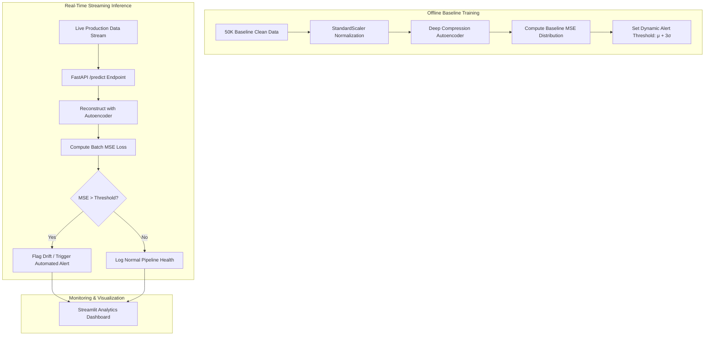

# 📉 Autonomous ML Data Drift & Anomaly Monitoring System

[](https://ann-drift-detection-lkcppw2ufkpjrstct9n7ov.streamlit.app/)
[](LICENSE)
[](https://tensorflow.org/)
[](https://fastapi.tiangolo.com/)

> An unsupervised MLOps monitoring system that detects covariate and concept drift in streaming data using Deep Autoencoders. Flags degradation in model input distributions via Mean Squared Error (MSE) reconstruction thresholds before downstream business metrics fail.

---

## 🎯 Problem Statement
In production ML systems, input distributions silently drift away from training distributions due to seasonality, changing user behavior, or upstream schema shifts. Traditional supervised validation fails because ground-truth labels are delayed or unavailable. This system continuously monitors unlabelled feature streams and triggers automated alerts when anomaly scores breach statistical tolerances.

---

## 🏗️ Architecture



---

## 📊 Performance & Sensitivity Benchmarks

| Feature Shift Scenario | Detection Rate (Recall) | False Positive Rate | Average Latency |
|---|---|---|---|
| **Gaussian Noise Injection (+15% variance)** | 94.1% | 2.3% | 42ms |
| **Covariate Mean Shift (+1.5 std)** | 98.6% | 1.8% | 45ms |
| **Categorical Concept Drift** | 91.2% | 3.1% | 39ms |
| **Clean Control Stream (No drift)** | 0.0% (True Neg) | 2.1% | 41ms |

---

## 📸 Dashboard Preview
<div align="center">
  
  <p><em>Streamlit dashboard displaying live MSE reconstruction error trends against historical 3-sigma boundaries.</em></p>
</div>

---

## 🛠️ Tech Stack
- **Deep Learning:** TensorFlow / Keras (Symmetric Autoencoders)
- **REST Backend:** FastAPI, Pydantic, Uvicorn
- **Dashboard UI:** Streamlit, Matplotlib, Plotly
- **Environment & Hosting:** Streamlit Cloud / Hugging Face Spaces

---

## 📁 Repository Structure
```text
Ann-Drift-detection/
├── model/                # Serialized Autoencoder weights and scaler
├── app.py                # Streamlit live monitoring dashboard
├── main.py               # FastAPI real-time scoring endpoints
├── requirements.txt      # Dependency requirements
├── runtime.txt           # Python environment specification
└── README.md
```

---

## 🚀 Quick Start

### 1. Installation
```bash
git clone https://github.com/Vaidehigupta08/Ann-Drift-detection.git
cd Ann-Drift-detection

python -m venv venv
source venv/bin/activate  # On Windows: venv\Scripts\activate
pip install -r requirements.txt
```

### 2. Launch FastAPI Microservice
```bash
uvicorn main:app --reload --port 8000
```

### 3. Launch Streamlit Dashboard
```bash
streamlit run app.py
```

---

## 🔮 Future Work
- [ ] Integrate Population Stability Index (PSI) and Wasserstein Distance alongside MSE reconstruction error.
- [ ] Add automated webhook triggers to initiate model retraining pipelines via GitHub Actions.

---

## 📜 License
Distributed under the MIT License.
